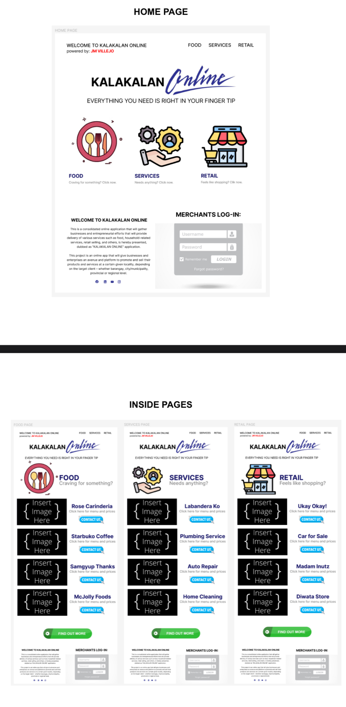
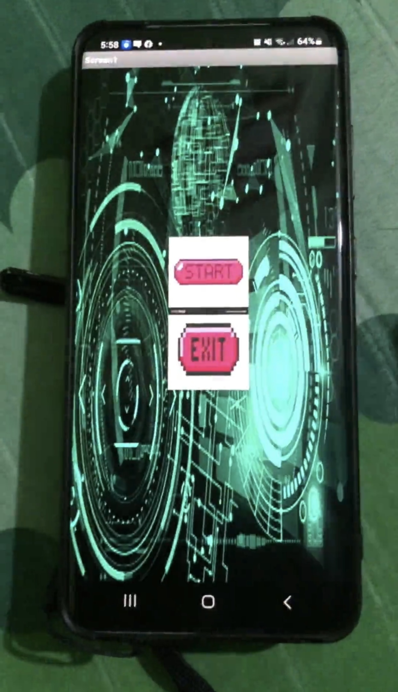

# jmportfolio

# About Me
Hi, I’m John Michael Y. Villejo, also known as JM. I’m studying IT  with a passion for solving problems and creating innovative tech solutions. Outside of work, I love exploring nature and gaming, both of which help me recharge and stay inspired.I’m proud of my journey and the challenges I’ve overcome. Despite the hardships, I’m still fighting, growing, and living each day with purpose. I believe in perseverance, continuous learning, and the power of staying curious. Feel free to connect if you`d like to talk tech and nature or gaming

### Objective
To stay motivated and dedicated to continuous learning in website design, animation editing, and photography. I aim to apply my growing skills to real-world projects, embracing mistakes as opportunities for growth. My focus is on achieving mastery in these fields by improving my abilities and consistently seeking opportunities to apply, refine, and expand my knowledge through practical experience.
                
### Education
- Bachelor of Science in Information Technology
- Philippine Christian University

### Skills
- Videographer
- Troubleshooting, Network Configuration, Cloud Services (AWS or Google Cloud), Team Collaboration
- Photographer
- editing

### Hobbies
- playing online games
- lestening to music
- watching movies
- nature exploring

### Projects
[Publication](https://jmyvillejo.wixsite.com/jemvv?fbclid=IwZXh0bgNhZW0CMTEAAR3YAxeSzX71sRivVMipeVDeQ5GW6-rXRVv4KOQQReL8A9e0IFoxdAPzrfY_aem_Xp96ouKQAnCjaZH9XRUmyw)

Online shop website

Working app

Working website on wixx app

